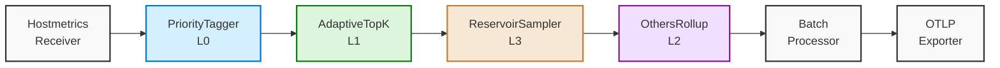
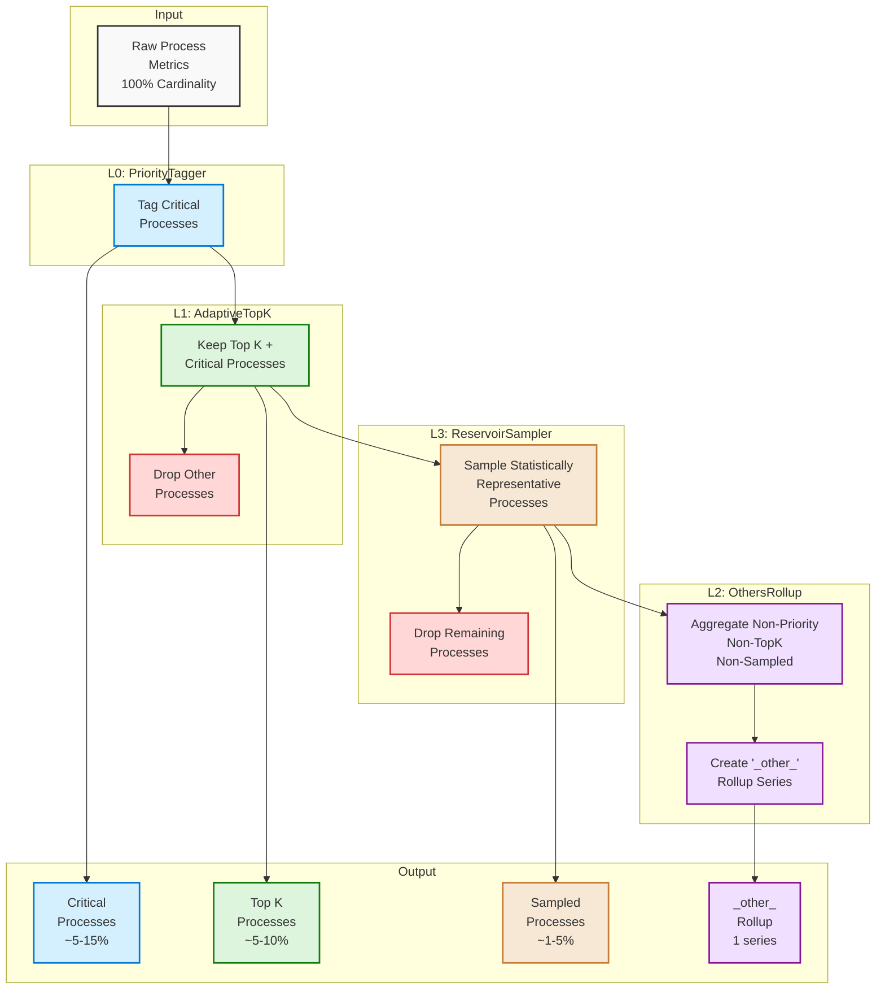
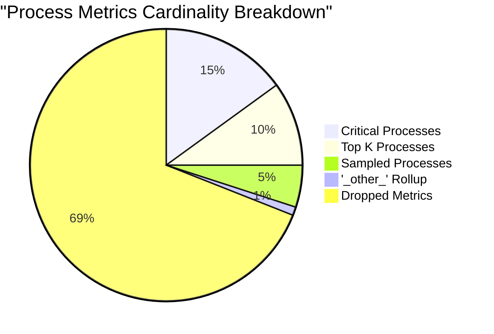

# NRDOT Process-Metrics Optimization Pipeline Diagrams

This document provides visual representations of the optimization pipeline to help understand the data flow and transformations.

## Basic Pipeline Flow

The following diagram shows the basic flow of data through the optimization pipeline:

## Data Transformation Details

This diagram shows how the data is transformed at each step, with approximate cardinality reduction:

## Cardinality Reduction Effect

This visualization shows the approximate cardinality reduction achieved by the pipeline:

## Per-Process Attribute Effect

The table below shows how the pipeline affects the attributes of different process metrics:

| Process Type | PriorityTagger | AdaptiveTopK | ReservoirSampler | OthersRollup | Final Output |
|-------------|----------------|--------------|------------------|--------------|--------------|
| **Critical** | `nr.priority="critical"` | Passed through | Passed through | Passed through | All original metrics retained |
| **Top K** | Unchanged | Selected | Passed through | Passed through | All original metrics retained |
| **Sampled** | Unchanged | Dropped | `nr.process_sampled_by_reservoir="true"` + `nr.sample_rate="0.xx"` | Passed through | Sampled metrics with sampling metadata |
| **Others** | Unchanged | Dropped | Dropped | Aggregated into `process.pid="-1"` + `process.executable.name="_other_"` | Single aggregated series (sum or avg) |

This approach allows for significant metric volume reduction while maintaining visibility into both critical and representative processes.

## Note on Viewing Mermaid Diagrams

These diagrams use Mermaid syntax which may require a compatible Markdown viewer. In GitHub, they should render automatically. In other environments, you might need a Mermaid plugin or viewer.

You can also paste the Mermaid code into the [Mermaid Live Editor](https://mermaid.live/) to view and edit the diagrams.